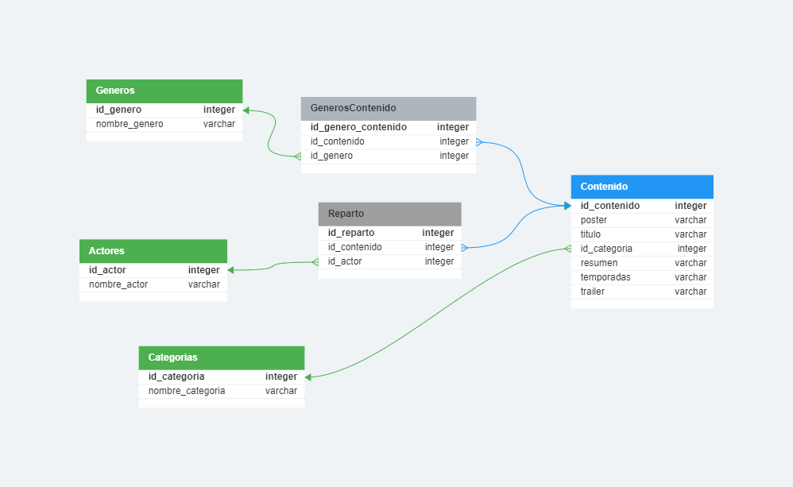

# Tercer proyecto integrador

Se desarrolla una API integrando MongoDB con la librería sequelize en un proyecto Node.js.

## Base de datos

En base a la consigna se diseñó la base de datos y sus relaciones mediante la herramienta [DB Designer](https://www.dbdesigner.net/)

## Funcionalidades

Esta API REST accede a los datos de la base de datos trailerflix mediante metodos get.

Para las rutas que requieren parametros, la busqueda de los datos no es case-sensitive.

### API Endpoints
| Verbo HTTP | Endpoints | Acción |
| --- | --- | --- |
| GET | /categorias | Devuelve todas las categorias almacenadas en la tabla categorias|
| GET | /catalogo | Devuelve todos los datos, tal como se presentan en el archivo .json original|
| GET | /catalogo/:id | Devuelve datos de un elemento filtrado por código de la película/serie |
| GET | /catalogo/nombre/:nombre | Devuelve elementos filtrado por nombre o parte del nombre|
| GET | /catalogo/genero/:genero | Devuelve elementos filtrado por genero|
| GET | /catalogo/categoria/:categoria | Devuelve elementos filtrado por categoria (serie/pelicula) |
| GET | /catalogo/actor/:actor | Devuelve elementos filtrado por nombre de actor (o parte del nombre) |

## Respuestas

Los endpoints devuelven representaciones JSON de los datos solicitados según los parametros utilizados.

## Codigos de estado

Esta API retorna los siguientes codigos de estado:

| Codigo de estado | Descripción |
| :--- | :--- |
| 200 | `OK` |
| 400 | `BAD REQUEST` |
| 404 | `NOT FOUND` |
| 500 | `INTERNAL SERVER ERROR` |